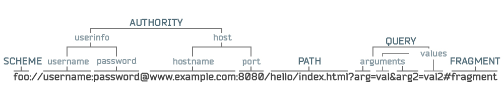

# SPA; vue-router

## Структура URL

## HTML5 History API

- Гайд: [https://developer.mozilla.org/ru/docs/Web/API/History_API](https://developer.mozilla.org/ru/docs/Web/API/History_API)
- Документация: [https://developer.mozilla.org/ru/docs/Web/API/History](https://developer.mozilla.org/ru/docs/Web/API/History)

## vue-router

Рекомендуется прочитать всю документацию от начала до конца, она не большая: [https://router.vuejs.org/](https://router.vuejs.org/).
  
### Это не было рассмотрено на вебинаре

- Документация библиотеки, использующейся для сопоставления маршрутов: [https://github.com/pillarjs/path-to-regexp/tree/v1.7.0#parameters](https://github.com/pillarjs/path-to-regexp/tree/v1.7.0#parameters)
- Отслеживание не найденных путей: [https://router.vuejs.org/guide/essentials/dynamic-matching.html#catch-all-404-not-found-route](https://router.vuejs.org/guide/essentials/dynamic-matching.html#catch-all-404-not-found-route)
- Использование нескольких компонент в разных местах на одном маршруте: [https://router.vuejs.org/guide/essentials/named-views.html#nested-named-views](https://router.vuejs.org/guide/essentials/named-views.html#nested-named-views)
- Подробнее про props у маршрутов: [https://router.vuejs.org/guide/essentials/passing-props.html](https://router.vuejs.org/guide/essentials/passing-props.html)
- Поведение прокрутки при переходе: [https://router.vuejs.org/guide/advanced/scroll-behavior.html#async-scrolling](https://router.vuejs.org/guide/advanced/scroll-behavior.html#async-scrolling)
- Подробнее про guards: [https://router.vuejs.org/guide/advanced/navigation-guards.html](https://router.vuejs.org/guide/advanced/navigation-guards.html)
     
## Одно-страничные приложения (Single-Page Applications, SPA)

### Традиционный подход

Когда-то давно, около 2000 года веб-сайты были набором связных HTML-документов. Как они работали? 

1. Пользователь, переходя на страницу (вводя адрес, переходя по гиперссылке или отправляя форму), переходил на страницу с определённым адресом. 
2. Браузер отправлял на сервер HTTP запрос
3. Сервер получал HTTP запрос, формировал каким-то образом HTML страницу, и отправлял HTTP ответ с HTML-документом. 
4. Браузер получал HTML документ и отображал его, попутно запрашивая другие ресурсы: медиа файлы, стили, скрипты. При загрузке скриптов -- выполнял их.

Любое действие, связанное с сервером (фильтры, поиск, любое манипулирование данными) - требовали новой загрузки страницы, её последующей инициализации со всеми скриптами.

В итоге, с одной стороны, веб-приложения - это клиент-серверные приложения, но с другой стороны вместо клиента мы имеем множество связных HTML документов. Клиентский код тесно связан с серверной частью, и формируется сервером.

Так сложно разрабатывать интерфейсы. Кроме того, это нагрузка на сервер и лишний трафик, ведь ради даже самого маленького действия нам требуется заново запрашивать весь HTML документ, который требуется сформировать на сервере.

### Ajax

Затем появляется новый подход -- ajax (я подчеркну, что ajax - это именно подход к разработке, а не название запросов и не сами запросы).

Это подход, при котором с уже загруженного HTML документа мы отправляем запросы из JS и обновляем части страницы без перезагрузки этой страницы. Теперь содержимое некоторых частей страницы определяется клиентом, а не сервером. Определяется уже в процессе работы в браузере. 

С таким подходом можно делать более интересные интерактивные сайты, делать **приложения**.  

Но правило - переход на новую страницу = запрос новой страницы с сервера оставался.

### Проблемы обычных веб-сайтов

1. Клиентская и серверная части сильно связаны. Клиентская часть часто генерируется инструментами серверной части.
2. Каждый переход -- загрузка новой страницы. Это трафик, время, нагрузка на сервер на генерацию страницы, и это повторная инициализация состояния клиентской части.  
    Клиент - как будто не одно полноценное приложение. Каждая страница - это отдельное приложение, и при переходе между ними мы переходим между приложениями, каждый раз запуская новое приложения.
3. Чтобы изменить адрес страницы мы запрашиваем новую страницу. Почему это важно? Адрес страницы используется при её сохранении и распространении. Мы хотим, чтобы адрес страницы был тесно связан с её состоянием. Чтобы мы могли поделиться ссылкой, и получатель открыл ту же страницу, с тем же содержимым (в том же состоянии).

### SPA

Новый подход - одно-страничные приложения (SPA, Single-Page Applications). "Одно-страничное" не значит, что у нас больше нет страниц. Это значит, что вся клиентская часть - это один **HTML документ на все страницы приложения**. 

Основная идея - заменить сайт из множества страниц одной, которая будет менять своё содержимое. Заменить веб-сайт из нескольких страниц одним JavaScript приложением. То есть перенести задачи **генерации страницы** и **маршрутизации** с серверной части на клиентскую.

Теперь клиент в веб-приложении - это не просто страница, которая пришла с сервера. Это полноценное **JavaScript приложение**, взаимодействующее с сервером посредством API. Подобно обычным клиент-серверным приложениям, теперь веб-приложения разделяется на две отдельные части: клиентское JavaScript приложение и сервер API. 

### Что нужно для SPA?

1. Генерация содержимого. На требуется эффективно и просто генерировать страницу на стороне клиента. Для этой задачи у нас уже есть инструмент -- Vue.js (и другие JS фреймворки).
2. Маршрутизация (роутинг, routing).
    - Нам требуется в зависимости от URL адреса определять текущее состояние приложения, его содержимое;
    - А также требуется менять URL адрес при изменении состояния приложения, имитировать переход на новую страницу. С этим поможет HTML5 History API + библиотека `vue-router`.

### Преимущества SPA

- Явное разделение веб-приложения на самостоятельную клиентскую часть и серверную части. Весь клиент, всего его страницы - одно JavaScript приложение.
- Клиент сохраняет состояние при переходе между страницами: делать инициализацию однократно, держать данные в памяти приложения, не терять его состояния, держать непрерывно работающие аудио и видео плееры, соединения и т.д.   
- Потенциально ускорение приложения и снижение нагрузки на сервер.

### Недостатки SPA

- JavaScript приложение не работает без включенного JavaScript. Совсем. Для кого-то это может стать проблемой даже в 2020.
- Снизилась нагрузка на сервер, но за счёт клиентов. Сайты стали потреблять больше ресурсов.
- SEO. Если раньше запрос с сервера мог вернуть HTML страницы, то теперь содержимое страницы будет генерироваться уже после загрузки приложения в браузере.
- Пользователь загружает не страницу, а "страницу, которая загрузит страницу". Загружается страница, которая в начале покажет только индикаторы загрузок, спиннеры, прогресс-бары, пока отпарвляются запросы на получение основных данных.
- HTTP статус. Сервер вынужден всегда успешно возвращать одностраничное приложение. Мы можем показать ошибку "404 - Страница не найдена", но ошибка будет сгенерирована на странице, полученной HTTP ответом со статусом 200 OK.

Некоторые проблемы решаются **изоморфными приложениями**, но о них мы поговорим в конце курса.
